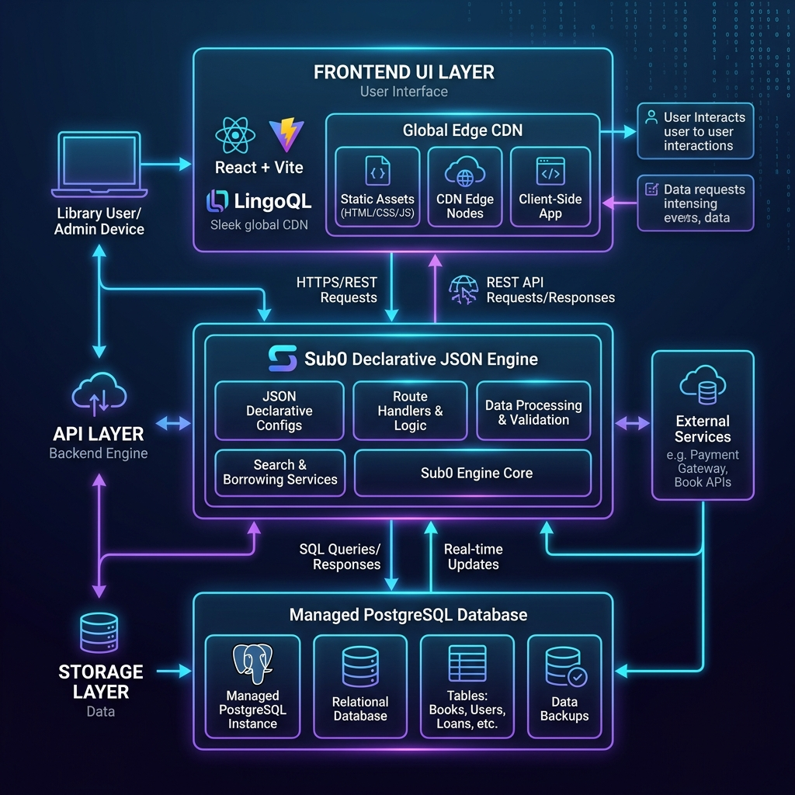

# 📚 Library Management System — Zero to Query Hackathon Edition

A modern, full-stack **Library Management System** built for the **Zero to Query Hackathon**. This repository has been refactored to conform to strict hackathon infrastructure rules:
1. **Backend Engine**: Database schemas, authentication, and REST APIs powered by the declarative **Sub0 Backend Engine** (`sub0.app`).
2. **Cloud Infrastructure**: Global hosting, continuous deployment, and serverless compute powered by **LingoQL** (`lingoql.com`).

---

## 🏛️ Hackathon Architecture



```
                  ┌─────────────────────────────────────────┐
                  │          LingoQL Infrastructure         │
                  │              (lingoql.com)              │
                  └────────────────────┬────────────────────┘
                                       │
                    ┌──────────────────┴──────────────────┐
                    │                                     │
         ┌──────────▼──────────┐              ┌───────────▼───────────┐
         │ React / Vite Client │              │ Sub0 Backend Engine   │
         │     (Frontend)      │ ──REST API─► │     (sub0.app)        │
         └─────────────────────┘              └───────────┬───────────┘
                                                          │
                                              ┌───────────▼───────────┐
                                              │ Managed Postgres DB   │
                                              └───────────────────────┘
```

### 1. Data Layer (Sub0 Backend Engine)
The application originally ran a monolithic Python Flask API with SQLAlchemy models (`backend/app.py`). It has been fully refactored to use **Sub0's declarative JSON schema** defined in [`sub0.json`](./sub0.json):
- **Models Configured**: `User`, `Student`, `Book`, `Transaction`, and `Fine`.
- **Automatic REST API**: Sub0 automatically generates secure CRUD endpoints targeting `https://api.sub0.app/v1/...`.
- **Built-in JWT Auth**: Native authentication handled directly at the database engine level with role-based access rules.

### 2. Frontend & Deployment (LingoQL Hosting)
- **Framework**: Built with **React** and **Vite**, styled with **Tailwind CSS**.
- **Cloud Agnostic**: Removed local proxy rules and Vercel-specific routing configurations. The frontend dynamically pulls the Sub0 endpoint from environment variable `VITE_SUB0_API_URL`.
- **Instant Deployment**: Configured for seamless automated building on LingoQL's global CDN infrastructure.

---

## 🛠️ Data Fetching & Refactored APIs

All API calls are centralized in [`src/lib/api.js`](./src/lib/api.js) and hit the Sub0 REST API engine:

| Function | Endpoint | Description |
| :--- | :--- | :--- |
| `login(email, password)` | `POST /v1/auth/login` | Authenticates user via Sub0 JWT engine |
| `register(name, email, password)` | `POST /v1/auth/register` | Registers new librarian user |
| `getBooks(params)` | `GET /v1/books` | Fetches book catalog |
| `addBook(bookData)` | `POST /v1/books` | Creates a new book entry |
| `issueBook(data)` | `POST /v1/transactions` | Records a book loan transaction |
| `returnBook(id)` | `PATCH /v1/transactions/:id` | Updates transaction status to Returned |
| `getFines()` | `GET /v1/fines` | Fetches overdue fines |

---

## 🚀 Getting Started

### Prerequisites
- Node.js `v18+`
- Sub0 account & API credentials (`sub0.app`)
- LingoQL dashboard access (`lingoql.com`)

### Local Setup
1. **Clone Repository:**
   ```bash
   git clone https://github.com/Raghavendra-yt/Zero_to_Query_hackathon.git
   cd Zero_to_Query_hackathon
   ```

2. **Install Dependencies:**
   ```bash
   npm install
   ```

3. **Configure Environment Variables:**
   Create a `.env` file in the root directory:
   ```env
   VITE_SUB0_API_URL=https://api.sub0.app
   ```

4. **Run Development Server:**
   ```bash
   npm run dev
   ```

5. **Build for Production:**
   ```bash
   npm run build
   ```

---

## ☁️ LingoQL Deployment Setup

1. Connect this repository to your **LingoQL Dashboard** (`lingoql.com`).
2. Point your backend service build step to `sub0.json`.
3. Set `VITE_SUB0_API_URL` under Environment Variables.
4. Set Build Command to `npm run build` and Output Directory to `dist`.
